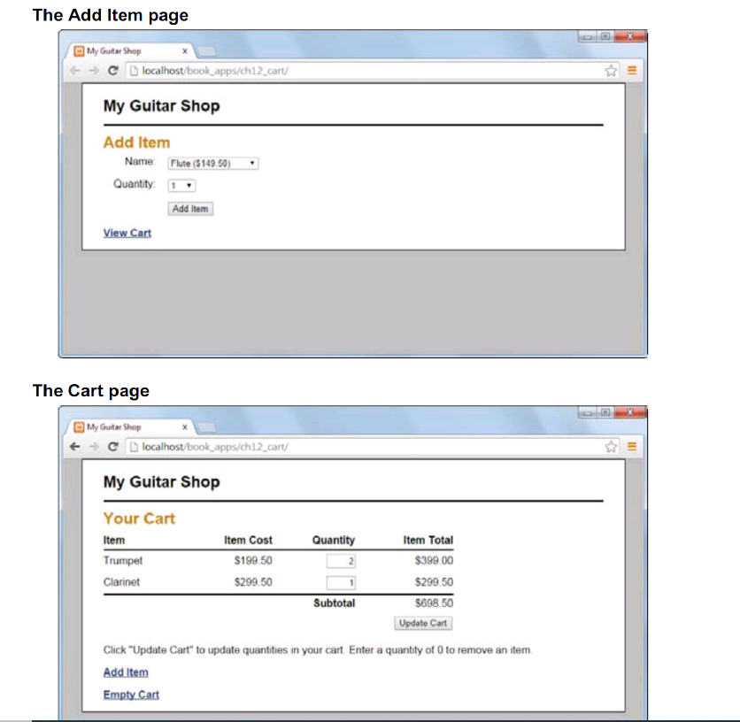

> The shopping cart applocation

* application that illustrates the use of sesion variables.

* Without session tracking, the code for this applocation would be much more complicated.
  
# The user interface

* Figure shows the user interface for the shopping Cart application. This application consists of two pages: the Add Item page and the Cart page.

* The add Item page allows the useers to add an item to the cart. In addition, it includes a link that allows the user to view the cart without adding item.

* The cart page displays all items in the user's cart along with a subtotal. From this page, the user can update the quantities for the items in the cart by changing the quantity and clicking the Update button. Or, the user can remove an item by changing the quantity to 0 and clicking the Update button. To add more items, the user can click on the Add Item link to return to the Add item page. Or, to remove all items from the cart, the user can click on the empty Cart link.

# The controller

### view the code of controller in index.php

* this code is stored in the index.php file. This file uses the functions in the **cart.php** file to add items to the cart and to update the items in the cart. In addition, it uses the **add_item_view.php** and **cart_view.php** to display the Add Item page and the Cart page.

* The controller begins by starting a session. Here, the first two statements use the **session_set_cookie_params** function to create a session that persists for two weeks. As a result, if the user closes the browser and returns within tw weeks, the user can continue his or her session.

* After starting the session, the code checks whether the cart array is empty in the $_SESSION array. if so, this code creates an empty array to store the cart. this code uses a key of **cart12** to access the cart in the $_SESSION array.

* after initializing the cart, this code will creates a multi-dimensional array of products.

* After creating a table of products, the controller loads the **cart.php** file. This file contains functions for working with cart array. These functions can add a new item to the cart or update the quantity of an existing item.

* After including the cart function, the controller gets the action to be performed based on the action parameter of the **POST** or **GET** request. if the action parameter hasn't been set, this code uses a default action of **show_add_item**.

* After getting the action, the controller uses a switch statement to perform the action. if the action is add, this code retrieves the new product key quantity from the POST request and passes it to the **add_item** fct, which add item to the Cart. Then, this case displays the Cart page.

# The model
* the **cart.php** file show the code that models the behaviours of the shopping cart. This code defines 3 fcts. thes fcts let you add an itel to the cart, update an item in the cart, and get the subtotal for the items in the cart.

## add_item()
* The add_item function takes an item key and quantity as its parameters and uses them to add specified item to the cart. To start, this code gets access to the global products array. Then, it checks if the quantity is less than 1. If so, this code exits the function .

* if the item isn't already in the cart, the add_item function gets the cost of the item from the product array and calculate the total for the item. Then, it creates an array that contains the item's name, cost , quantity, and total. Next, it stores the item array in the cart array using the item's key as the index.

# the Add Item view

* the add_item_view.php shows the code for the Add Items page. This page displays a form that lets the user add an item to the cart by selecting a product and a quantity for that item. In addition, this page displays a link that lets the user view the cart without adding an item.

* The form uses The **POST** method to submit the data back to the index.php controller for processing. This form includes a hidden field with a name of **action** and a value of **add** to indicate that the controller should add the item to the cart. 
* The first <select> tag has a name of **productKey**. this tag lets the user select a product from a dop-down list. Whithin this tag, the **PHP** code uses a foreach loop to generate the <option> tags for the drop-down list. At the begining of the loop, this code formats the cost of each item as a number with two digits, and it uses the item name and formatted cost to generate the text to display for the item.
