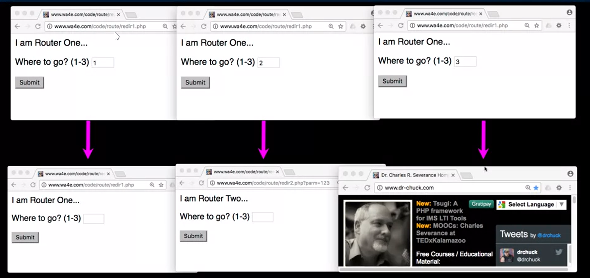

# Model View Contoller

A diagram that shows how the **MVC** pattern workd for the Product Manager application. To start,
## The Model
the model consists of the PHP files that represent the data of the application. In this diagram, the model include three files: 
* a database.php file that gets a connection to the database; 
* category_db.php product_db.php file that works with the category and products data in the database. As a general rule, the model files don't contain any HTML.

## The view
The **view** consists of the **HTML** and **PHP** files that represents the user interface of the application. For a web application, the user interface consists of one or more web pages. In this diagram, the view consists of three files: 
* The **products_list.php** file displays the page that lets the users view and delete products;
* the **product_add.php** file  displays the page that lets the user add a product;
* The **database_error.php** file displays a page that displays an error message if the application isn't able to connect to the database. 
As a general rule, the view files contain the **HTML** tags for the application with some embedded **PHP** tags that display the dynamic data that's returned from the database.

## The Controller
The **contoller** consists of the **PHP** files that receive **HTTP** requests from browser, get the appropriate data from the model, and return the appropriete views to the browsers. In this diagram, the controller consists of just one file:
* The **index.php** file. This file is the default file for the application's directory. As a result, this is the file that's called when the user starts the application.
* The **controller** consists of the PHP files that receive requests from users, get the appropriate data from the model, and return the appropriate views to the users.

# Redirect
## HTTP Status Codes
* http://www.dr-dollitle.com/page1.htm  - 200 OK
* http://www.dr-dollitle.com/nowhere  - 404 Not Found
* http://www.dr-dollitle.com/  - 302 Found/Moved
ALso known a "redirect" 

## HTTP Location Header
* if your application has not yet sent any data, it can send a special header as part of the HTTP Response.
* The redirect header includes a URL that the browser is supposed to forwrd itself to
* It was originally used for web sites that moved one URL to another.

* the **include** function is to **forward** a request from one PHP file to another. When you forward a request, all processing takes place on the server.
* You can use teh header function to **redirect** a request to another URL. When you redirecta request, you return a reqponse to the browser that has a location header that specifies a page. This header causes the brpwser to make a new request for the specified URL.
* The header function and the include function affect the browser's address bardifferently. When you use the include function, the browser will display the **URL** of the original page. When you use the header function, the brwoser will display the URL of the page you redirect to.
* header($header): Sends an HTTP header to the browser. For example, you can use this function to send an HTTP Location header to the browser to redirect the browser to another URL.
### Example:
header("Location: .?category_id=$category_id)
the redirect here appends a parameter with a name of category_id and a value that's stored in the $category_id variables. To do that.it codes a quenstion mark **(?)**, followed by the parameter name, followed by an equals sign(=), followed by the parameter value.


```php
<?php
session_start();
if(isset($_POST['where'])=='1'){
    header("Location: redir1.php");
    return;   
    }else if(isset($_POST['where'])== '2'){
        header("Location: redir2.php?parm=123");
        return;
    }else{
        header("Location: http://www.google.com);
        return;
    }
?>

<html>
<body style="font-family: sans-serif;">
<p> I am Rooter Two ...</p>
<form method="post>
    <p><label for="inp9"> Where to go? (1-3)</label>
    <input type="text" name="where" id="inp9" size="5">
    <input type="submit"/></form>
</body>
```


And so this is just a simple bit of code and again, it's model view controller and that there is a magic line. Down here is the view, this is the model, and this part is kind of the controller. So model is kind of updating the parts of this that update the database. But, the controller is also the routing and the what are we going to do next and how is this all going to work. And so this is where the controller really starts to sort of, you can see lines that you go like, that's controller. So this part is controller, so what we're going to have is a little tiny form, right. 'where', and we're going to put a number into it, and if it's a 1, we're going to redirect to redir1.php, this file is redir1.php. If it's a 2, we're going to redirect to redir2.php, we can put get parameters on here. And you don't have to be the same server, you can redirect to anywhere that you want to redirect. You'll notice that I come in, there are no lines, I do a header, and then I return. Meaning there's no point in following through and doing this output because I said that retrieve but it's not put in the DOM. All right, it doesn't go into the DOM, it just is retrieved and then it goes and gets the next thing. So you return, so that is the end of this script. We get out, we get out, we get out. So you'll see and you'll type this a lot, time to redirect header return, header return, header return. So pretty much almost every time you say header shortly within a line or two you're going to say, return. So, on a 1 it redirects back to itself, on a 2 it redirects to redir2.php with a parameter and on 3 it redirects to dr-chuck.com. So if you're to run this code and you type in a 1, you'll see it goes right back to itself, redir1.php. If you type in a 2 to redir1.php it redirects to this one, and the next page you'll see is redir2. And you can put get parameters on here, this'll turn out to be useful later and if you type a 3, it posts to this and then it gets told to redirect to dr-chuck.com. And so that's the three things that this code can do. Just demonstrating how the location header and the header function works.
