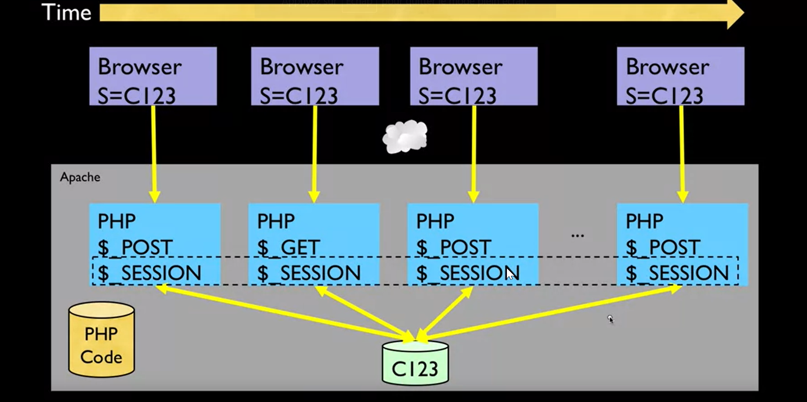
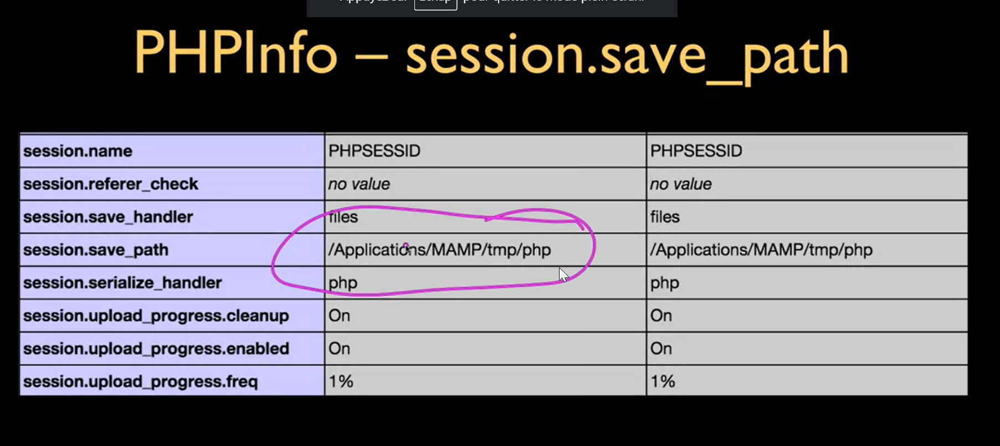
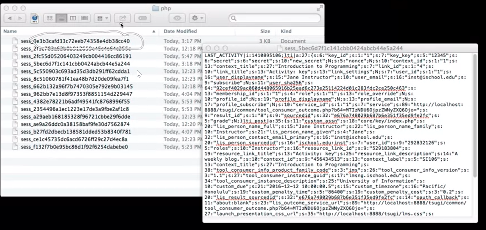
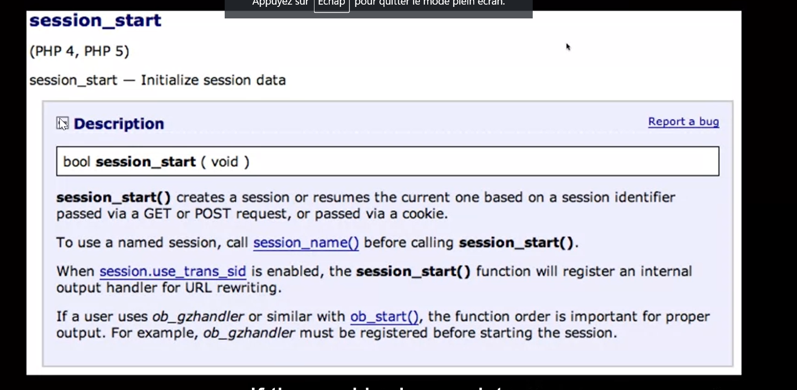
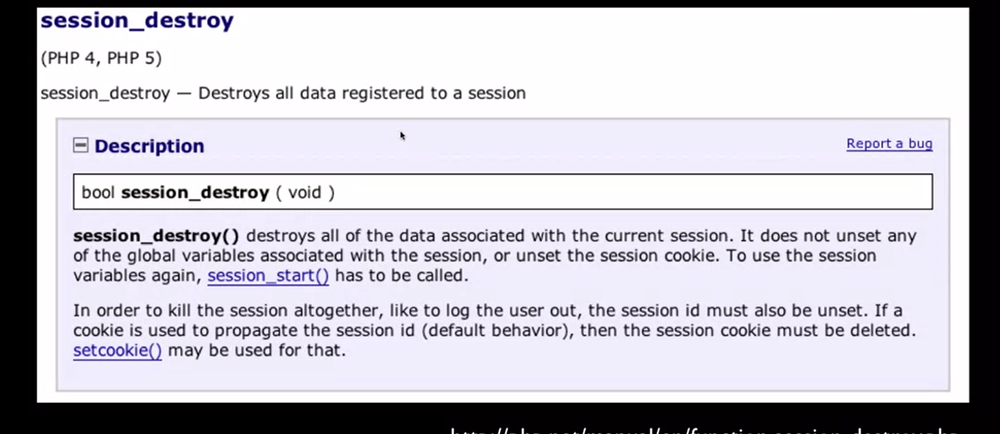

> sessions
* so now we're going to talk about PHP sessions. Now they're related to cookies, but you really have to separate them. So cookies are a browser concept and an HTTP concept. So, just to review, the server sends a cookie, and then it's stored in browser. And then the browser sends it back. We saw the set cookie request in the cookie header, sessions are data that we store in the server. So, it wouldn't store the current account balance or even the current logged in user at least unencrypted in a cookie, because this is part of the browser, and you can change it, You can delete it. You can throw them away. But what we can use is this cookie to effectively unlock a session. And a session is a little bit of data stored generally in the web server. Although you can store it externally in all kinds of servers depending, for more advanced things. And it can even be stored in the database, but for now, we'll just take it the simple way. It's not in the database. It's a little tiny file that lives on the server. And so just like when this request is coming in, we have Get Post.

* what's cool about session is this is a two-way connection. Cookies are sort of a two-way. We can use set cookie to send it as well. But session is data that's really easy. when we meet a new browser, we check to see if there is a session cookie. It's still a cookie, but a session cookie. And if there is no session cookie, we make up a large random number, some unique mark, and then we send it as a cookie, and then we create a session with that same identifier. And then we get the next request, we see, there's a session cookie here. And then we reconnect to that session, and away we go. And so the PHP takes care of a lot of the session stuff for us, like a web framework. And so the session identifier is security by obscurity. We pick a large random number, we turn it into hex characters, and we stick in it in the browser, and we stick that in a cookie. Now, if you somehow compromise your session identifier and lose the session identifier, then someone could fake the session identifier because they could change the cookie in their browser and take over your session. But because these are such large random numbers, we generally don't worry too much about that. And they only live for a little while, so when you close your browser that session is gone and it's gone on the server as well. So we tend to store not too much data in the session, but if you take a look and you took a typical application, especially a php application and you go to it for the very first time, you'll see this cookie. Now you can change the name of this cookie in the configuration of your PHP. By default the cookie is named php session ID. And that is coming back from the browser on the first page, long before you press the login.on anything. And so there's a session. And the login is different. We'll talk about login later. The session is just a place to store data, that is a two-way place to store data.
## In the Server - Session
* In most server applications, as soon as we meet a new (unmarked) browser we create a session.
* We set a session cookie to be stored in the browser, which indicates the session id in use - gives this browser a unique **"mark"**.
* The creation and destruction of sessions is handled by a web framework or some utility code that we use in our applications.
## Session Identifier
* A large random number that we place in a browser cookie the first time we encounter a browser.
* This number is used to pick from the many sessions that the server has active at any one time.
* Server software stores data in the session that it wants to have from one request to another from the same browser.
* Shopping cart or login information is stored in the session server.

## PHP Sessions
* We can establish / initialize a PHP session by calling **session_start** before any output has come out.
* if the user has cookies set, we can use the array **$_SESSION** to store data from one request to the next with a particular browser.
* We have a bit of data that persists from one request to the next.
* By default, these are stored in a temporary folder on disk.
* If the user has cookies, we can then use the session variable to store from one request to another. So this is the two-way variable, you can take stuff out of it and you can put stuff back in. And so now we have a bit of stuff that you probably wish, why can't I keep that post data. Well a post data manages and is recreated on every request response cycle, but the session is not, it's reassociated. So you have a cookie that reassociates the session, and the default place that we store these things is on disk.
* 

* So now we have a time situation where once you got the session established, the cookie comes in, it pulls the session into the session variable. If in your data you change it, then that data is written back up to the disk and then this response comes out. Now, sometime later, we do another thing that creates a GET request with some GET parameters. And then we pull the session data in, and then we can make changes to the session data, and then we send the response. Time passes, another post comes in. It makes post data, so the post is created each time. Different post data, we pull the session data out. And then if we make changes we put the session data back, send the request, time passes, you get the idea. Comes in, got this a post request, we get new post data. But then we pull the session data into session, we make changes in here, get sent back, and the response happens. So this is sort of it's like global variable across a series of requests response cycles. And it is a key value array. You get to pick the keys. You get to do whatever. Now, one thing we don't do put gigantic stuff in session. We use it sort of like little bread crumbs for our application like logging in and logging out of something we're going to store in this session area.

## PHP Info - session.save_path
* 
* 

* You can find out where your server is configured by PHPInfo. You can find out where it's storing the sessions at, and you can even go look at the sessions. And there you go, you'll say, look, here we go. This is a little file and it's keyed by the session ID. So when the request comes in, it goes and find this little file. And if you were to look at this, they're not guaranteed to be viewable but this happens to be viewable. It's kind of a series of key value pairs in here and says it's an integer. This is sort of a magic format that we're not supposed to look at. But it's the kind of stuff that's being stored Into and out of the session variable is stored on disk.

* 
* If the cookie doesn't exist, the session create, an empty session, and sets the cookie. If the cookie does exist, it reassociates the old session. Whichever the case is, once you're done $_session can be used. So you can't use session until you call session_start. The GET and POST and the cookies are set before the first line executes. The session is only set after you call session_start.

* 
* The cookie unlocks the session, the cookie reassociates the session, but the cookie is not the session. 

## How to work with session
* Keeping track of users as they move around a website is known as **session tracking**.
  
## Why session tracking is dificult with HTTP

* why session tracking is more difficult for web applications that use **HTTP** than it is for other types of applications. To start, a browser on a client requests a page from from a web server. After the web server returns the page, it closes the connection. When the browser makes a subsequent request, the web server has no way to associate the current request with the previous request. Since HTTP doesn't maintan state, it is known as a **statless protocol**.

* PHP 5.5 only use cookies to work with session ID. As a result, session tracking only works if the user has cookies enabled. however, if you need your application to work correctly even for users who have cookies disabled, PHP can encode the session ID in the URL. This is sometimes called **URL encoding**, and you can configure your system so PHP transparently encodes the session ID in the URL. Unfortunatly there are several problem with this approach.
* By default PHP use cookie to store a session ID in each browser. Then the browser passes the cookie to the server with each request.
* **session_set_cookie_params($liftime)** function to control how the session cookie works , so to customize the cookie for the session, and must be called before the session_start().

## How to set and geta  scalar variables
### Set a variable in a session
```php
$_SESSION['product_code']= 'MBT-1234';
```
### Get a variable in a session
```php
$product_code = $_SESSION['product_code'];
```
## How to set and get arrays
### Set an array in a session
```php
if(!isset($_SESSION['cart'])){
    $_SESSION['cart'] = array()
}
```

### Add an element to an array that's stored in a session
```php
$_SESSIOn['cart']['key1'] = 'value1';
$_SESSIOn['cart']['key2'] = 'value2';
```
## Get and use an array that's stored in a session
```php
$cart = $_SESSION['cart'];
foreach($cart as $item)
{
    echo '<li>' .$item. '<li>';
}
 ```
##How to remove variables from a session
### Remove a session variable
```php
unset($_session['cart']);
```
### Remove all session variables
```php
$_SESSION = array();
```
# Description
* Once you start a session, you can use the autoglobal $_SESSION variable to set and get the user's data for  session. This variable is an associative array.
* if necessary, you can use the isset function to test if an element already exists in the $_SESSION array.
* You can use the **unset** function to remove an element from the $_SESSION array. However, don't use the unset function on the $_SESSION as it can cause inpredictibale results.
* You can set the $_SESSION array to an empty array to remove its contents.

# How to end a session
* **session_destroy()** Ends a session. Returns True if successful and False otherwise.
## End a session 
```php
$_SESSION =array(); // Clear session data from memory
session_destroy();  // Clean up the session ID
```
## Delete the session cookie from the browser
```php
$name = session_name();                   // Get the name of session cookie
$expire = strtotime('-1year');           // Create expire date in the past     
$params = session_get_cookie_params();  // Get session params
$path = $params['path'];
$domain = $params['domain'];
$secure = $params['secure'];
$httponly = $params['httponly'];
setcookie($name, '', $expire, $path, $domain, $secure, $httponly);
```
# Description 
* A session ends when the user closes the browser, when a specified amount of time elapses without a request, or when the code calls the session_destroy function.
* to remove all data associated with the session from the client and the server, you can clear the session data from memory, call the session_destroy function, and use the setcookie function to delete the session cookie.
* The session_name function gets the name of the session cookie. By default, the session cookie has a name of "PHPSESSID".
* The session_get_cookie_params function gets an associative array that contain all of the parameters for the session cookie.
  
  # How to manage a session
  ## Function to manage sessions
  * **session_name()** Get the name of the session cookie. The default is PHPSESSID.
  * **session_id(['$id])** If the parameter isn't specified, this function gets the current session ID. if no session exists, this function gets an empty string. if the parameter is specified, this function sets the session ID to the specified value.
  * **session_regenerate_id()** Creates a new session ID for the current session. Returns true if successful and FALSE otherwise. This function can be used to help prevent session **hijacking**
  * **session_write_close()** Ends the current session and saves session data. This function is only needed in special cases like redirects.
  ### Get the name of the session cookie
```php
  $name = session_name();   // by default, PHPSESSID
```
### Get the value of the session ID
```php
id = session_id();   // for example , l1jef1hg2gdz8h6uiop2b2t1
```
### Set the session ID
```php  
session_id('abc123');
```
